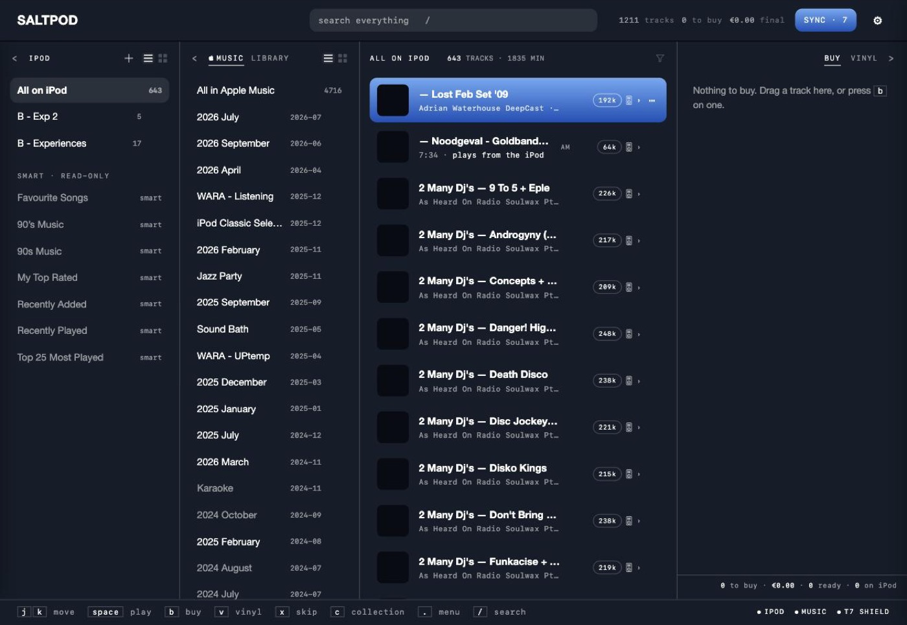
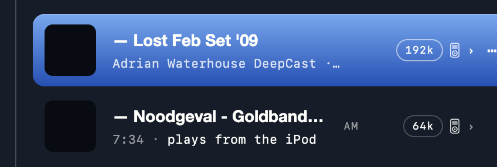
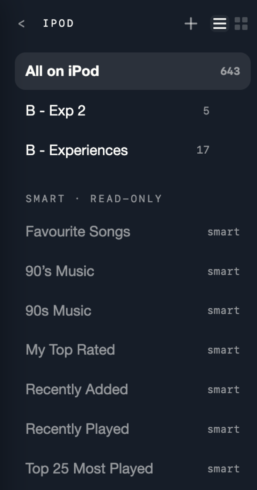
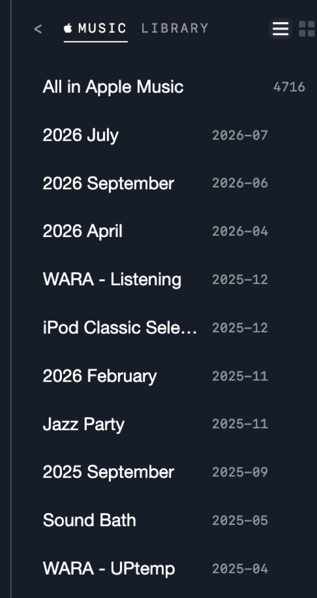
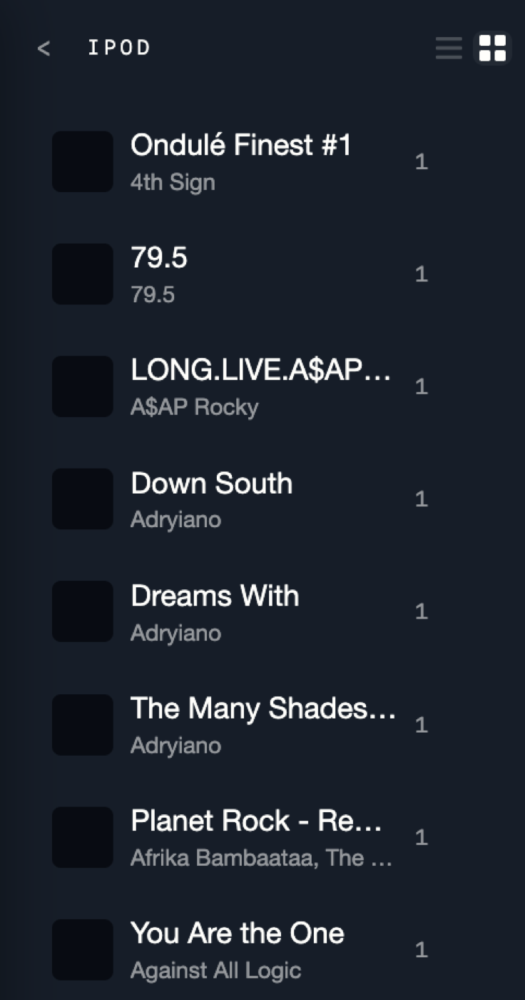
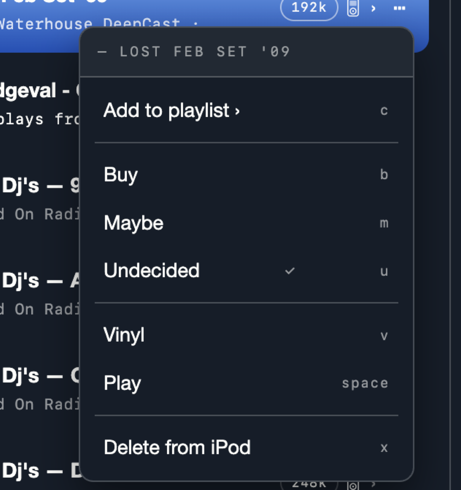
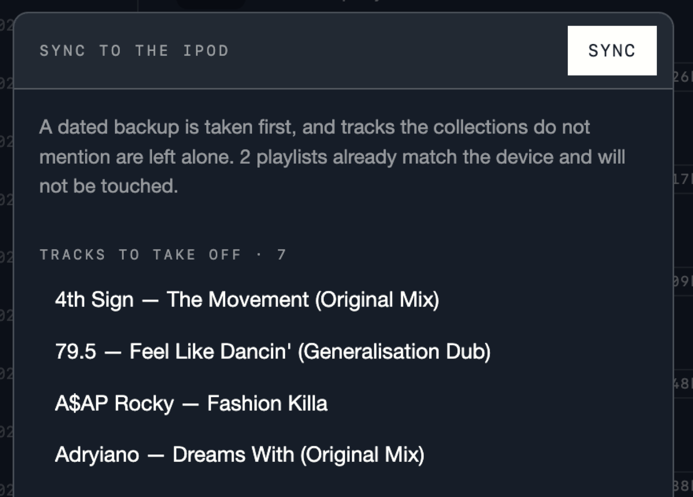

# A look at saltpod

What the tool actually looks like, and why each part is shaped the way it is.
Every screenshot here is the real page against a real library — 1,211 curated
tracks, 643 of them on a 160 GB iPod Classic.

If you want the reasoning behind these decisions rather than the result,
[HISTORY](../HISTORY.md) is the narrative and [HANDOFF](../HANDOFF.md) is the
current state.

---

## The whole thing

One page, four columns, no navigation. Left to right it reads as a sentence:
**this is what the iPod holds · this is where music comes from · this is what
I am looking at · this is what I still have to go and buy.**

There are no tabs and no screens. Everything is one workspace because curation
is one activity — you do not "go to" the buy list, it fills up as a
consequence of decisions you make in the middle.

---

## The header

Brand, search, counts, Sync, settings. The counts are quiet on purpose: they
are context, not the job. **Sync is never one click** — it reads the device
first and shows you the diff. `SYNC · 7` means seven changes are waiting;
without a number, the device already matches.

Under about 1100px the counts hide rather than clip, because a strip sliced to
45px is not a smaller reading of the numbers.

---

## A row

The densest thing in the tool, and every part of it earns its place.

| | |
|---|---|
| **Full ink vs dimmed** | Full means you could put it on the iPod today — a file exists. Dimmed means you cannot: not bought, or bought and not yet indexed. **That gap is what the tool exists to close**, so it is what the eye catches first. |
| **`AM T7 LP`** | Where the track *lives*: Apple Music, the drive, a record. Facts about the world, so they are plain — no borders. Owned shows in full ink, rented stays faint. |
| **The pill** | The quality figure, and it is format-aware: `320k` for a lossy file, `16/44.1` for a lossless one. Bitrate is the quality knob for an MP3 and says nothing about a FLAC, where depth and sample rate are the answer. It is read from **the original on disk**, never the converted copy on the device. |
| **The iPod mark** | Drawn only when the track is actually on the device, and it sits beside the chevron where it never moves. |
| **`⋯`** | Everything a drag can do, a click can do too. |

Artwork comes from the iTunes match where there is one, and **out of your own
file** where there is not — extracted with ffmpeg and cached. On this drive
that is the difference between 5 covers and 381.

---

## The iPod pane

Collections — the playlists that will be written. **Every non-smart playlist
already on the device is one of these**, adopted on read: there is no
difference between what this tool made and what iTunes left behind, and both
are yours to edit or delete.

Smart playlists are shown and never written. They belong to the firmware.

The count beside a collection turns **orange** when a sync would still have
work to do for it.

---

## The source pane

Where music comes *from*, two libraries behind two words, the way Buy and
Vinyl share the pane on the right. You take from one or the other, never both
at once, so they never need to be on screen together.

**Apple Music** is what you have listened to. **Library** is what you already
own, grouped by the folders on the drive itself — no taxonomy is invented,
because the folders are how the music was filed when it was bought.

Nothing here is edited. A track earns a record in state only when you decide
something about it; otherwise the curation queue would be the whole library
and mean nothing.

---

## Albums

The mark at the top right of each pane switches it between **lists** and
**albums**. An album is a lens, not a container.

That matters for what a drag does. The Classic builds its Albums menu out of
the tracks' own tags, so **putting an album on the iPod means moving its
tracks and nothing else** — writing a playlist named after it would put the
same record in two different menus.

Albums group on the album name alone. Keying on artist *and* album looked
safer and shattered every compilation: only 904 of this drive's 4,048 files
carry an `album_artist` tag, so a games soundtrack came out as one album per
performer. Mixed performers show as *Various Artists*, which is what the
device does too.

---

## The menu

Every row and every list has one. **Nothing in this tool is drag-only** —
dragging is faster once you know it, and a menu is how you find out it is
possible at all.

The last item reads *Delete from iPod* when the track is on the device and
*Skip* when it is not, because those are different sentences.

---

## Sync

Sync asks the device what it holds, shows the diff, and writes only on
confirm. It names what it is about to take off and what it is about to add,
and says plainly what it will leave alone.

The rules underneath, which the panel is there to make visible:

- **A dated backup precedes every write.**
- **Tracks the collections do not mention are left alone.** Sync never wipes
  something it was not told about.
- **A playlist that already matches is not rewritten.**
- **Sequence is the product.** A collection is written in the order you
  arranged, never sorted.

---

## The footer

Shortcuts on the left, and on the right one slot per thing the tool depends
on — the iPod, Music.app, each drive. Always present, only ever changing
state, because a bar that appears when something breaks moves the layout at
exactly the moment your attention is needed elsewhere.

After a good sync the iPod is *gone*, and that must never look like a fault:
the strip says **ejected**, not absent.
